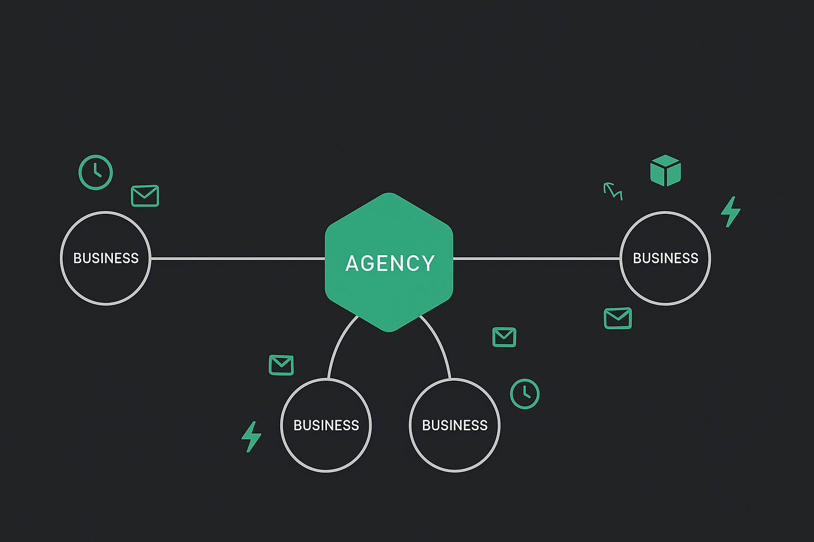
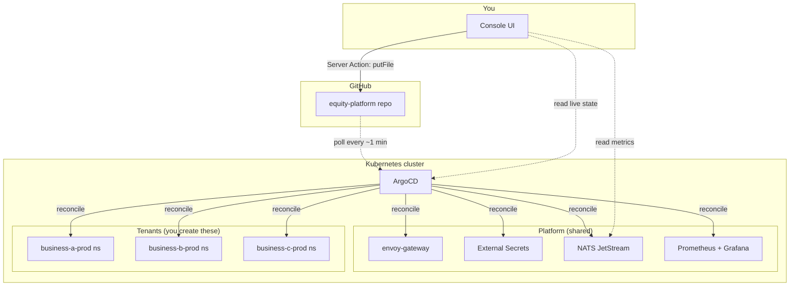
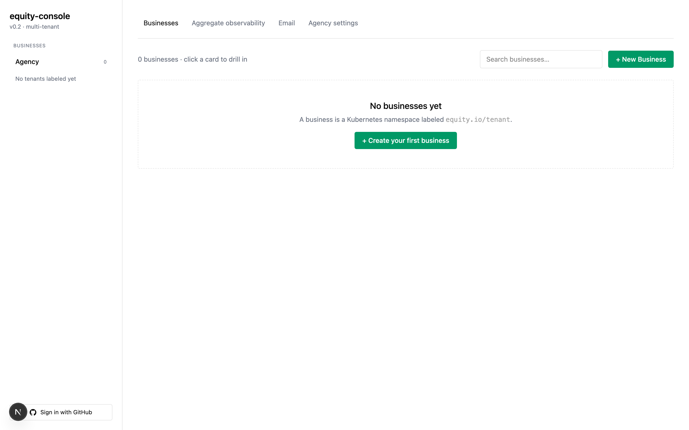
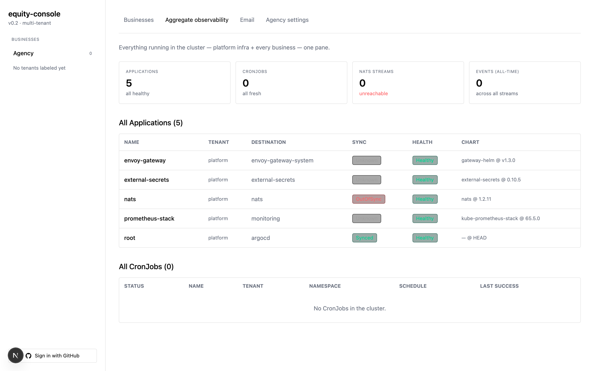
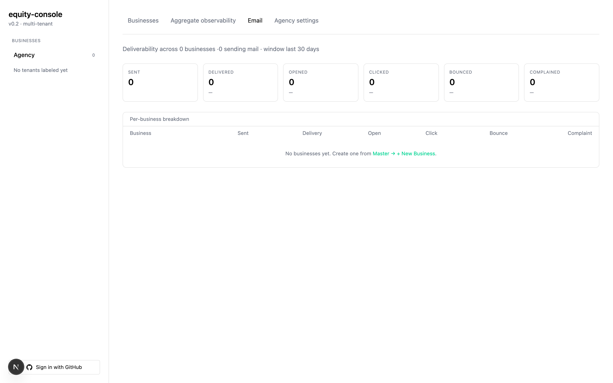
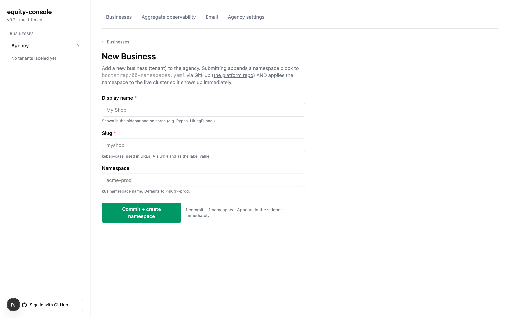

<div align="center">
  
</div>

<div align="center">

[](LICENSE)
[](https://kubernetes.io/)
[](https://argo-cd.readthedocs.io/)
[](https://nats.io/)
[](https://nextjs.org/)

**One-command Kubernetes platform for the sub-agency model.**
Rapidly acquire, build, scale, and exit businesses with AI. Boot locally in 3 min ($0). Provision new apps from the UI — every change is a git commit, every rollback is a `git revert`.

[Quick Start](#-quick-start) · [The console](#-the-console) · [Add a business](#-add-a-business) · [GitOps write-back](#-gitops-write-back) · [Reproducibility](#-reproducibility-contract)

</div>

---

## Why this exists

Running multiple businesses on Kubernetes normally means re-deriving the same infra decisions per business, wiring GitOps by hand, and juggling three different UIs to see what's actually running. This repo bundles all of that into **one repo, one command, one console**.

**What you get out of the box:**
- Local kind cluster (~3 min boot, $0)
- ArgoCD wired app-of-apps, pinned versions
- External Secrets Operator, NATS JetStream, Prometheus + Grafana as ArgoCD Applications
- **Multi-tenant Next.js console:** master view aggregating every business + per-business drill-in
- **UI-driven app provisioning:** fill a form → commit lands in git → ArgoCD reconciles
- **Rollback via git revert:** history page links straight to GitHub's revert UI
- One script up, one script down. No manual state, ever.

---

## Architecture



```
equity-platform/
├── local/           → kind cluster + one-command up.sh / down.sh
├── bootstrap/       → ArgoCD install + root app-of-apps + tenant namespaces
├── apps/            → ArgoCD Application manifests (children)
├── charts/          → per-app Helm values, pinned versions
├── console/         → Next.js 15 multi-tenant UI (see below)
└── .github/         → CI (shellcheck + yamllint + kubeconform) + CodeQL
```

Inside `console/app/`:
```
[tenant]/
├── page.tsx         → per-tenant overview
├── apps/
│   ├── page.tsx     → ArgoCD Applications table
│   └── new/         → provision form + Server Action (writes to git)
├── cron/            → CronJobs table with staleness heuristic
├── email/           → deliverability page (per-tenant Postgres)
├── events/          → NATS JetStream streams + consumers
└── history/         → recent commits + revert links
```

Routes: `/master` = aggregate, `/<slug>` = per-business drill-in.

---

## Quick Start

**Requirements:** Docker, Node.js 20+, [Homebrew](https://brew.sh/) on macOS (or your platform's kind/kubectl/helm binaries).

```bash
# 1. Install tools
brew install kind kubectl helm

# 2. Clone
git clone https://github.com/jaredzwick/equity-platform ~/equity-platform
cd ~/equity-platform

# 3. Boot the cluster
./local/up.sh
# → creates kind cluster (~90s)
# → installs ArgoCD v2.13.1 (~2min)
# → applies platform namespaces (no tenants yet — you create them via the console)
# → applies root app-of-apps if a git remote is set

# 4. Start the console
cd console
npm install
npm run dev
# → open http://localhost:3030
```

You'll land on `/master`. Click a business in the sidebar to drill in.

**Tear down when done:**
```bash
./local/down.sh
```

Idempotent. Destroys the kind cluster. Filesystem stays clean.

---

## The console

<table>
  <tr>
    <td><a href="docs/screenshots/01-master-businesses.png"></a><br/><sub><b>Businesses</b> — sidebar auto-populates from k8s namespace labels</sub></td>
    <td><a href="docs/screenshots/02-master-aggregate.png"></a><br/><sub><b>Aggregate observability</b> — apps + crons + NATS streams across every tenant</sub></td>
  </tr>
  <tr>
    <td><a href="docs/screenshots/03-master-email.png"></a><br/><sub><b>Email deliverability</b> — sent / delivered / opened / bounced rolled up across tenants</sub></td>
    <td><a href="docs/screenshots/05-master-new-business.png"></a><br/><sub><b>New Business</b> — commits a namespace block to <code>bootstrap/00-namespaces.yaml</code> and applies it live</sub></td>
  </tr>
</table>

<sub>Agency settings screenshot: <a href="docs/screenshots/04-master-settings.png">docs/screenshots/04-master-settings.png</a> (full-height form).</sub>

The console is the whole UX. Sidebar lists every business (auto-discovered from namespace labels). Each business has 6 tabs:

| Tab | What it shows | Data source |
|---|---|---|
| **Overview** | Apps + CronJobs at a glance, stale-cron warnings | k8s API (filtered by tenant ns) |
| **Apps** | ArgoCD Applications table, one-click "+ New Application" | k8s API (`argoproj.io/Applications`) |
| **Cron** | Every CronJob, staleness heuristic (red if no success in 24h) | k8s BatchV1 API |
| **Email** | Deliverability, bounce rate, complaint rate | Per-tenant Postgres `email_events` (opt-in) |
| **Events** | NATS JetStream streams + consumers + lag | NATS `/jsz` monitoring endpoint |
| **History** | Recent commits to this repo + revert links | GitHub API |

Master view (`/master`) aggregates across every business.

### NATS monitoring needs a port-forward locally

```bash
kubectl port-forward -n nats svc/nats-headless 8222:8222 &
```

Or set `NATS_MONITOR_URL` in `console/.env.local`. Full env template in `console/.env.example`.

---

## Add a business

**Preferred: use the console.** Master view → **+ New Business** → fill in display name + slug + namespace → Save. The console:
1. Commits a new namespace block to `bootstrap/00-namespaces.yaml` via GitHub
2. Applies the namespace to the live cluster immediately
3. Opens the new tenant's Profile tab so you can fill in brand, offer, legal, etc.

**By hand:** append a namespace block to `bootstrap/00-namespaces.yaml`:

```yaml
apiVersion: v1
kind: Namespace
metadata:
  name: myshop-prod
  labels:
    equity.io/tenant: myshop
    equity.io/tenant-name: MyShop
```

Then `kubectl apply -f bootstrap/00-namespaces.yaml` or re-run `./local/up.sh` (idempotent).

Either way, the console auto-discovers the new tenant on next request — appears in the sidebar and gets its own drill-in view.

### Business profile

Each tenant has a declarative YAML profile at `businesses/<slug>.yaml` in the platform repo. Edit via the console (`/<slug>/profile`) or by hand. Fields: identity (LLC, domain, emails), brand (logo, colors, tagline), offer (price, Stripe IDs, CTA), copy (headlines, about, voice), legal (jurisdiction, EIN, policy URLs), integrations (GHL, n8n, Meta, GA, PostHog, Slack). Schema lives in `console/lib/business-profile.ts` — add a field there and the form regenerates.

---

## GitOps write-back

The console can provision new ArgoCD Applications for you. **Every change is a commit; every commit is reversible.**

**Enable it:**

1. Create a [fine-grained GitHub PAT](https://github.com/settings/personal-access-tokens/new) with **Contents: Read and Write** scoped to this repo.
2. In `console/.env.local`:
   ```
   GITHUB_TOKEN=github_pat_...
   GITHUB_REPO=jaredzwick/equity-platform
   ```
3. Restart `npm run dev`.

**Use it:** Sidebar → pick a business → **Apps** → **+ New Application**.

```
     Form submit
         │
         ▼
   Server Action  ─▶  GitHub API  ─▶  2 commits land in the repo
         │                                    │
         │                                    ▼
         │                          ArgoCD polls (~1 min)
         │                                    │
         ▼                                    ▼
    Redirect to             ArgoCD reconciles new Application
    /<tenant>/apps                            │
                                              ▼
                                       App live in cluster
```

**Rollback:** **History** tab → **revert →** on any commit → opens GitHub's one-click revert PR → merge → ArgoCD reconciles previous state (~1 min).

---

## Reproducibility contract

**The whole system boots and tears down with two scripts.** This is the promise:

```bash
./local/up.sh      # boot: kind + ArgoCD + platform apps + tenants
./local/down.sh    # nuke: everything gone
```

Nothing is manual. Every infra change is a file in this repo. Every runtime change is a commit in this repo (via console) or a `kubectl apply` in your terminal.

Verified end-to-end on every push: shellcheck + yamllint + kubeconform against `bootstrap/` and `apps/`. Required to merge. CodeQL runs weekly.

---

## Design decisions

| Choice | Alternative | Why this |
|---|---|---|
| **kind** local | k3d / minikube | Best ArgoCD-local docs, ~90s boot |
| **ArgoCD** GitOps | Flux, no GitOps | Better UI = better observability for solo devs |
| **App-of-apps** | ApplicationSet | Simpler; upgrade when >20 apps |
| **NATS JetStream** | Redis Streams / Kafka | Persistent + replayable + no ZooKeeper |
| **External Secrets Operator** | SOPS / Sealed Secrets | Backend-agnostic — swap DO Secrets / 1Password / SOPS |
| **Namespace-per-tenant** | Cluster-per-tenant | Cheaper for solo shops |
| **Contents API for write-back** | Local git clone + shell out | No git state to manage; works local + in-cluster |
| **2 commits per new app** | Git Data API (atomic) | Simpler; upgrade when atomicity bites |
| **Revert via GitHub link** | In-console revert | Keeps destructive actions in the review-friendly flow |

---

## Roadmap

- [ ] cert-manager + Let's Encrypt ClusterIssuer
- [ ] Alertmanager → Slack integration
- [ ] Per-tenant NATS subject prefixes (`events.<tenant>.>`)
- [ ] Grafana panels embedded in tenant pages
- [ ] Prod overlay for DO Kubernetes
- [ ] 1-commit-per-app via Git Data API (atomicity)
- [ ] In-console diff + revert (no GitHub round-trip)

---

## License

**Business Source License 1.1** © 2026 Pypes LLC. Auto-converts to Apache 2.0 on **2030-08-03**. See [LICENSE](./LICENSE) + [NOTICE](./NOTICE).

**TL;DR:**
- ✅ Self-host it internally to run your own business — free forever.
- ✅ Read, modify, fork, redistribute the source.
- ❌ Offer it as a hosted/managed SaaS to third parties that competes with Pypes LLC's hosted version — that needs a commercial license (`commercial@pypes.dev`).
- 🔓 On 2030-08-03 (or four years after each release, whichever is later), the license auto-converts to Apache 2.0.

Pypes LLC operates a commercial **hosted equity-platform** — a separate offering not covered by this repository. See [COMMERCIAL_BOUNDARY.md](./COMMERCIAL_BOUNDARY.md) for how the OSS core and commercial layer are split.
